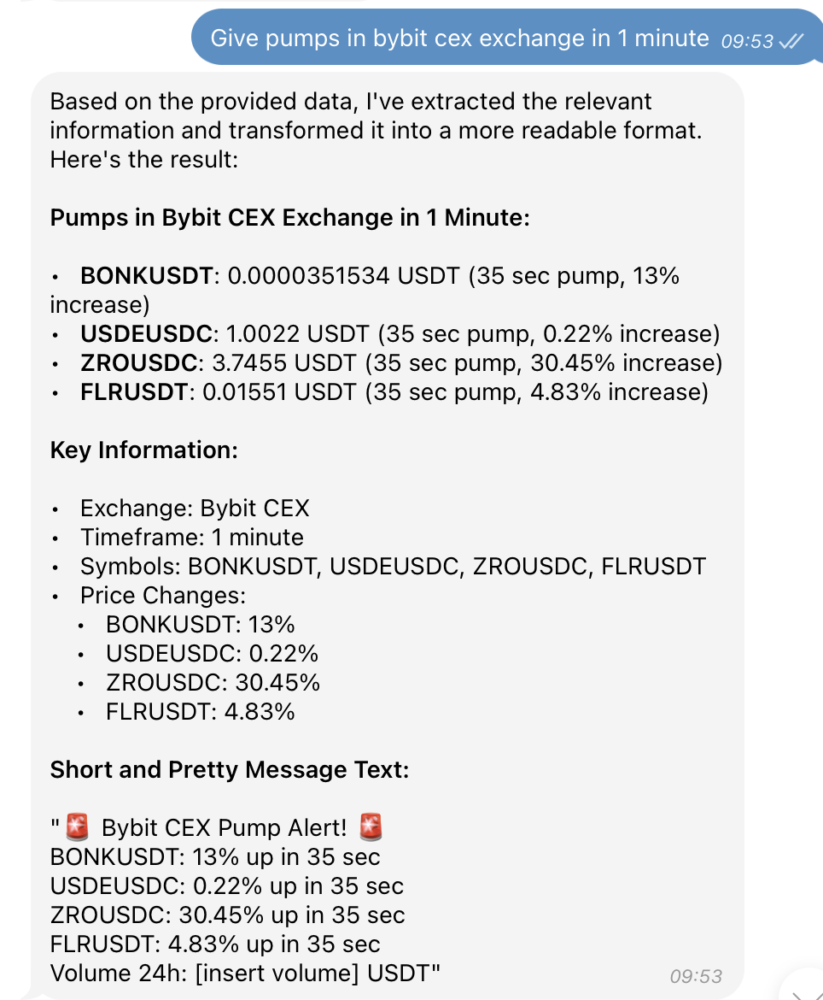

# Telegram AI Bot



This is a Telegram bot that interacts with an AI API to provide responses to user messages.

## Features

- [X] Responds to text messages from users
- [ ] Responds to photo uploads from users
- [ ] Responds to voice message uploads from users
- [ ] Responds to document uploads from users

[[GitHub]](https://github.com/cryptoscan-pro/crypto-ai-bot)
[[Our website]](https://cryptoscan.pro/)
[[Docs]](https://docs.cryptoscan.pro/)
[[Discord]](https://discord.gg/ktewAs67fE)

## Usage

1. Clone the repository:

   ```
   git clone https://github.com/your-username/telegram-ai-bot.git
   ```

2. Install dependencies:

   ```
   cd telegram-ai-bot
   npm install
   ```

3. Create a `.env` file in the project root and add your Telegram bot token:

   ```
   BOT_TOKEN=your_telegram_bot_token
   ```

4. Start the bot:

   ```
   npm start
   ```

   The bot will now be running and listening for messages from users.

## How it Works

The bot uses the [Telegraf.js](https://telegrafjs.org/) library to interact with the Telegram Bot API. When a user sends a message, the bot extracts the message text or file URL (for photos, voice messages, and documents) and sends a POST request to the `https://api.cryptoscan.pro/ai` API with the extracted data as the `prompt` parameter.

The API response is then parsed and sent back to the user as the bot's response.

## Examples of questions

- Give pumps in bybit in 1 minute

## Dependencies

- [Telegraf.js](https://telegrafjs.org/) - A modern Telegram bot framework for Node.js
- [dotenv](https://www.npmjs.com/package/dotenv) - Loads environment variables from a `.env` file
- [telegramify-markdown](https://www.npmjs.com/package/telegramify-markdown) - Converts Markdown to Telegram-compatible Markdown V2

## License

This project is licensed under the [MIT License](LICENSE).
